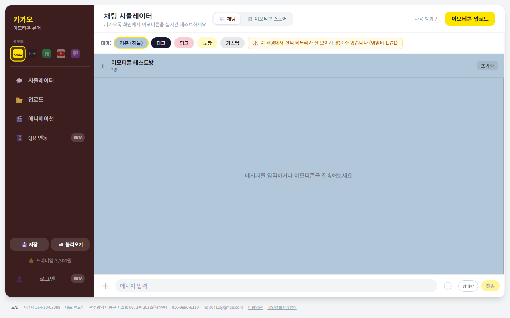
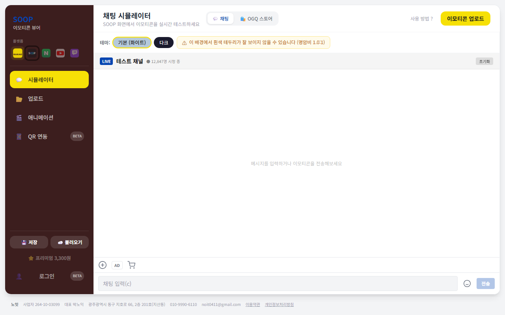
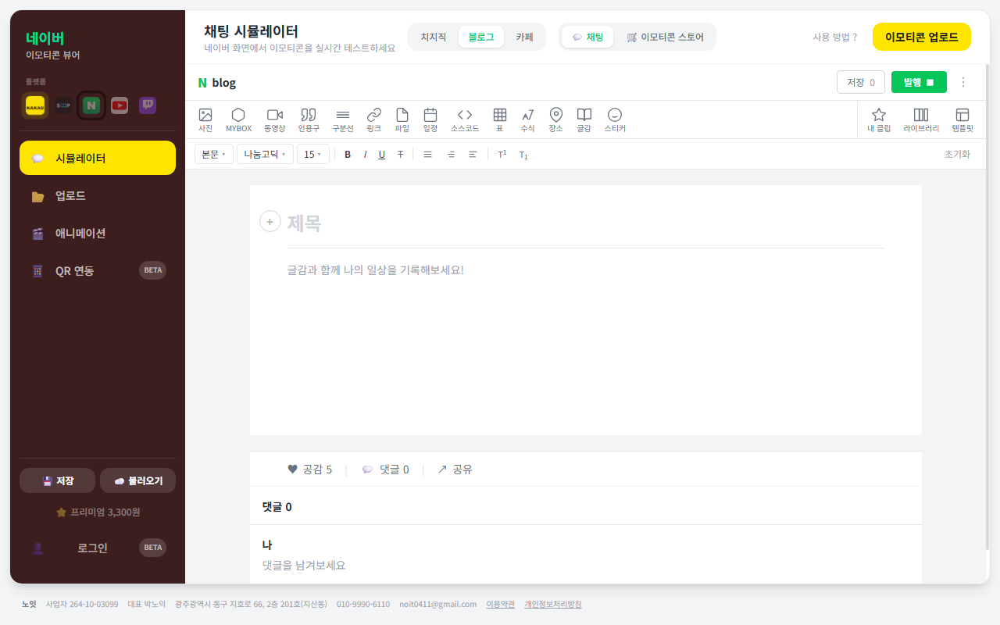
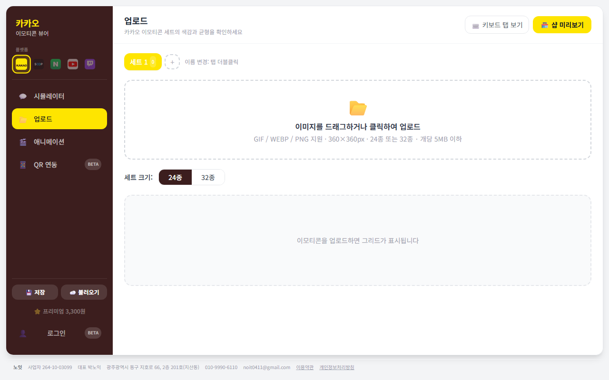
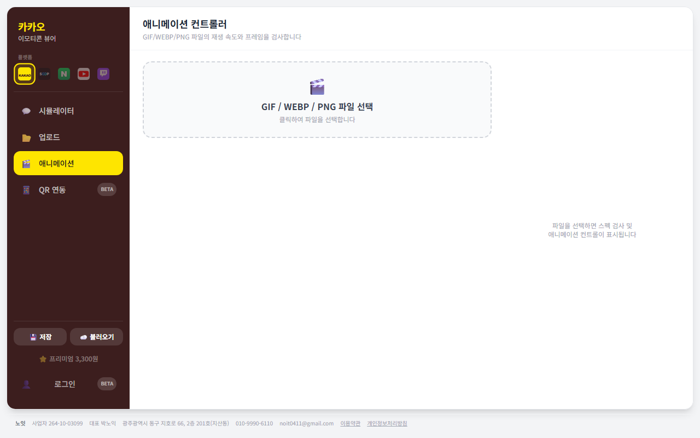
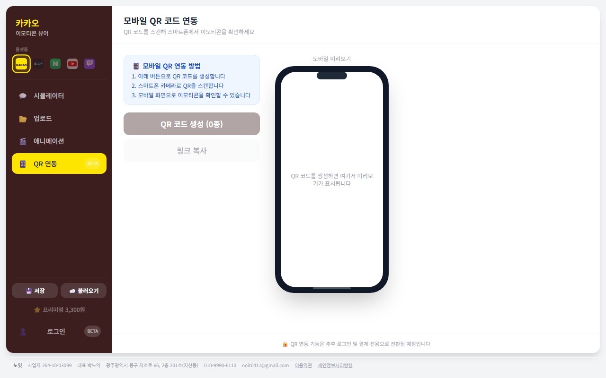

# 이모티콘 뷰어 🖼️

> **이모티콘 제출 전, 실제 화면에서 먼저 확인하세요**  
> 카카오톡 · SOOP · 네이버 OGQ · YouTube · Twitch 5개 플랫폼에서 이모티콘이 어떻게 보이는지  
> 실시간으로 미리볼 수 있는 **완전 무료 웹 도구**입니다.

<br>

## 📱 스크린샷

| 채팅 시뮬레이터 (카카오) | SOOP 라이브 채팅 | 네이버 OGQ 블로그 |
|:---:|:---:|:---:|
|  |  |  |

| 그리드 & 업로드 | 애니메이션 컨트롤러 | 모바일 QR 연동 |
|:---:|:---:|:---:|
|  |  |  |

<br>

## 🚀 핵심 기능

- **5개 플랫폼 채팅 시뮬레이터** — 카카오톡(말풍선), SOOP · YouTube · Twitch(인라인 라이브 채팅) 등 플랫폼별 실제 UI로 이모티콘 전송 테스트
- **그리드 & 스토어 미리보기** — 드래그앤드롭 정렬, 카카오 이모티콘 샵 · SOOP 채널 · OGQ 마켓 레이아웃 모달 프리뷰
- **애니메이션 스펙 검사** — GIF 프레임 추출(omggif), 플랫폼별 사이즈 · 용량 · 프레임 수 스펙 자동 검증, 재생속도 조절
- **모바일 QR 연동** — LZString URL 해시로 이모티콘 압축 전송, QR 코드 생성으로 실제 폰에서 즉시 확인
- **테마 & 커스텀** — 플랫폼별 다크·라이트 테마 + 커스텀 배경색, 명암비 경고(WCAG 기준)

<br>

## 🛠 기술 스택

| 영역 | 기술 |
|------|------|
| 프론트엔드 | React 18, TypeScript, Vite |
| UI 스타일링 | Tailwind CSS |
| 상태 관리 | Zustand (persist) |
| 라우팅 | React Router v6 |
| GIF 처리 | omggif (프레임 분해) |
| 드래그앤드롭 | @dnd-kit/core, @dnd-kit/sortable |
| QR 생성 | qrcode.react |
| URL 압축 | lz-string |
| 인증 · DB | Supabase |
| 배포 | Vercel |

<br>

## 🏗 프로젝트 구조

```
src/
├── config/
│   └── platforms.ts       # 5개 플랫폼 스펙 단일 소스 (사이즈·포맷·테마·채팅 UI)
├── store/
│   ├── platformStore.ts   # 활성 플랫폼 선택 (persist)
│   ├── themeStore.ts      # 플랫폼별 테마 (platformThemes 배열)
│   └── emoticonStore.ts   # 이모티콘 목록 (플랫폼 무관, persist)
├── pages/
│   ├── SimulatorPage.tsx  # 채팅 시뮬레이터
│   ├── GridPage.tsx       # 그리드 & 업로드
│   ├── AnimationPage.tsx  # 애니메이션 컨트롤러
│   ├── QRPage.tsx         # QR 연동
│   └── Mobile*.tsx        # 모바일 전용 뷰 (Kakao / SOOP / Chzzk)
├── components/
│   ├── simulator/         # ChatBubble, LiveChatView, PlatformChatHeader
│   ├── grid/              # ShopPreview (플랫폼별 스토어 모달)
│   └── animation/         # GIF 프레임 뷰어, 스펙 리포트
└── utils/
    └── specValidator.ts   # PlatformSpec 파라미터 기반 스펙 검증
```

**화면 흐름**

```
플랫폼 선택 (사이드바 5개 칩)
  ↓
채팅 시뮬레이터 → 이모티콘 업로드 → 그리드 확인 → 애니메이션 검사 → QR로 폰 전송
```

<br>

## ⚡ 주요 구현 포인트

### 1. 플랫폼 단일 소스 설계 (`platforms.ts`)

플랫폼마다 사이즈·포맷·채팅 UI 스타일이 다르기 때문에, 모든 플랫폼 스펙을 `platforms.ts` 하나에서 관리합니다.  
컴포넌트는 스펙 객체를 받아 렌더링하므로 플랫폼 추가 시 이 파일만 수정합니다.

```ts
// src/config/platforms.ts
export const PLATFORMS: PlatformConfig[] = [
  {
    id: 'kakao',
    name: '카카오톡',
    spec: { maxSize: 360, formats: ['GIF','WEBP','PNG'], maxFileKB: 5120 },
    chatUI: 'bubbles',       // 말풍선 UI
    theme: { primary: '#fee500' },
  },
  {
    id: 'soop',
    chatUI: 'inline-flow',   // 인라인 라이브 채팅 UI
    spec: { maxSize: 240, formats: ['PNG','GIF'] },
    theme: { primary: '#ff6600' },
  },
  // ...
]
```

### 2. GIF 프레임 분해 & 스펙 검증

`omggif` 라이브러리로 GIF를 프레임 단위로 파싱합니다. 추출한 프레임 수·지연시간과 플랫폼 스펙을 비교해 합격 여부를 즉시 판단합니다.

```ts
// src/utils/specValidator.ts
export function validateSpec(file: File, spec: PlatformSpec) {
  const reader = new GifReader(buffer)
  const frames = reader.numFrames()
  return {
    pass: frames <= spec.maxFrames && file.size <= spec.maxFileKB * 1024,
    frameCount: frames,
    fileSizeKB: Math.round(file.size / 1024),
  }
}
```

### 3. QR 모바일 연동 — URL 해시 압축

이모티콘 이미지를 LZString으로 압축하여 URL 해시에 담고, QR 코드로 공유합니다.  
서버 업로드 없이 브라우저 간 P2P 전달이 가능합니다.

```
PC  →  LZString.compressToEncodedURIComponent(imageData)  →  QR 생성
폰  →  QR 스캔  →  /mobile#<hash>  →  LZString.decompress  →  채팅 렌더링
```

### 4. 플랫폼 전환 시 테마 자동 리셋

플랫폼을 바꾸면 이전 플랫폼의 커스텀 테마가 남지 않도록 `platformStore`가 전환 시점에 `themeStore.resetForPlatform()`을 호출합니다.

```ts
// src/store/platformStore.ts
setPlatform: (id) => {
  set({ activePlatform: id })
  useThemeStore.getState().resetForPlatform(id)
}
```

<br>

## 🔧 로컬 실행

```bash
# 의존성 설치
npm install

# 개발 서버 실행
npm run dev
# → http://localhost:5173
```

> Supabase 인증·결제 기능을 사용하려면 `.env` 파일에 `VITE_SUPABASE_URL`과 `VITE_SUPABASE_ANON_KEY`를 설정하세요.  
> 미설정 시 로그인 없이 이모티콘 미리보기 기능은 모두 사용 가능합니다.

<br>

## 📎 링크

| | |
|---|---|
| 서비스 | https://emoticonviewer.site |
| 카카오 이모티콘 스튜디오 | https://emoticonstudio.kakao.com |
| SOOP 파트너센터 | https://partner.sooplive.co.kr |
| 네이버 OGQ 마켓 | https://ogqmarket.naver.com |
